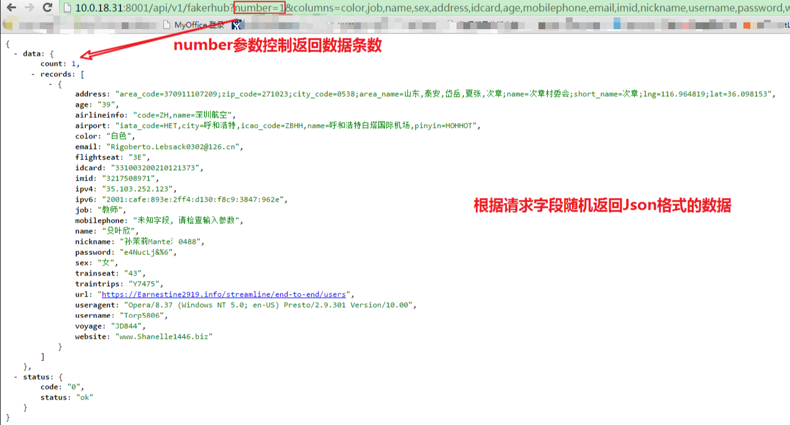

# FakerHub
伪造测试数据的API服务

## 结合中国国情，伪造测试数据

伪造测试数据的库有很多，Python有大名鼎鼎的[faker](https://github.com/joke2k/faker)，Golang有[gofakeit](https://github.com/brianvoe/gofakeit)，
但是这些库的中文本地化都不够完善，工作中用的数据大部分是中文，因此想做一次本地化，方便团队开展测试，不再为测试数据发愁。

美中不足的是，faker和gofakeit都只是一个第三方库，不是一个服务，需要自己写代码来调用才能达到测试效果，而且安装部署起来依赖包比较多（个人目前研发生产环境均为内网，无法连接互联网），部署实在是不方便。

于是我就想如果我做成一个性能比较好的服务，提供API，让大家都能通过HTTP请求灵活获取所需的数据，岂不美哉！而且这个服务的应用面应该是很广的，可以用于单元测试、功能测试、性能测试、可靠性测试，而且可以解决研发生产环境没有持续的测试数据的痛点！

为什么没有用Python？考虑到几个方面：
* Python的部署比较复杂，Golang只要编译好提供二进制文件就好，比较方便（经常出差去客户现场，部署开发环境就是噩梦）。
* Golang的并发性能比较好（虽然Python也有Tornado框架）。

## 目前已经支持的数据类型

| 序号   |     参数      | 说明                                    |
| :--- | :---------: | ------------------------------------- |
| 1    |    color    | 颜色                                    |
| 2    |     job     | 职业                                    |
| 3    |    name     | 中文名字                                  |
| 4    |     sex     | 性别                                    |
| 5    |   address   | 地址信息（地区编号、邮编、固话区号、省市信息、社区名称、社区简称、经纬度） |
| 6    |   idcard    | 大陆居民身份证号码                             |
| 7    |     age     | 年龄                                    |
| 8    | mobilephone | 移动电话号码                                |
| 9    |    email    | 电子邮箱                                  |
| 10   |    imid     | IM类型的用户ID                             |
| 11   |  nickname   | 用户昵称                                  |
| 12   |  username   | 用户名                                   |
| 13   |  password   | 用户密码                                  |
| 14   |   website   | 网站地址                                  |
| 15   |     url     | 网址URL（随机http或https）                   |
| 16   |   airport   | 国内机场信息（IATA编码、城市名称、ICAO编码、机场名称、城市拼音）  |
| 17   |   voyage    | 国内航班号                                 |
| 18   | airlineinfo | 国内航空公司信息（代号、中文名称）                     |
| 19   | traintrips  | 火车班次（覆盖高铁、动车、特快、普快、城际、旅游专线）           |
| 20   |  trainseat  | 火车座号                                  |
| 22   | flightseat  | 飞机座号                                  |
| 23   |    ipv4     | ipv4的点分型IP地址                          |
| 24   |    ipv6     | ipv6的点分型IP地址                          |
| 25   |  useragent  | 浏览器请求头                                |

## 使用效果

## 鸣谢
- [gofakeit](https://github.com/brianvoe/gofakeit) Random fake data generator written in go.
- [faker](https://github.com/joke2k/faker) Faker is a Python package that generates fake data for you.
